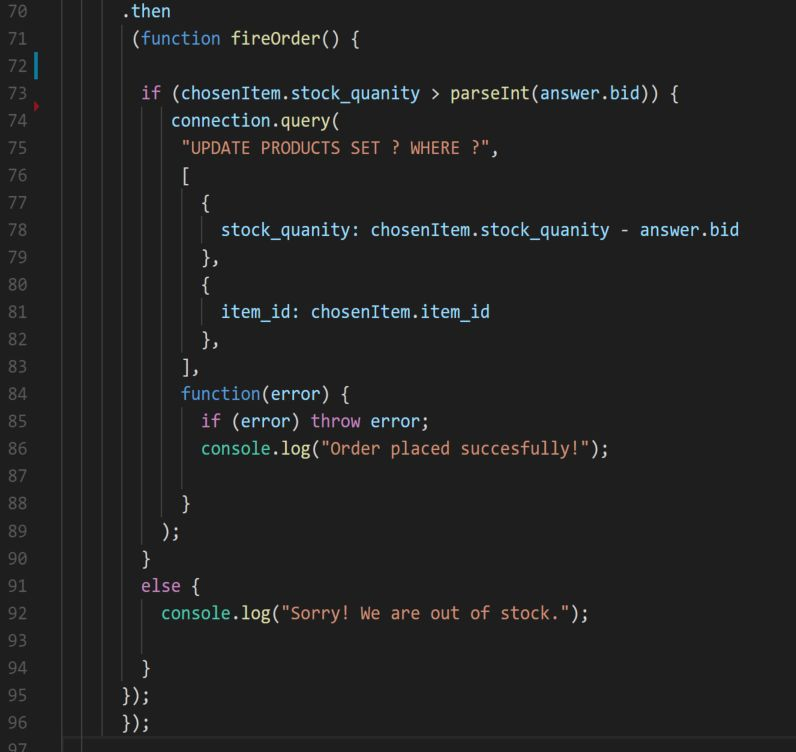

# imaginethat01.github.io-Node-MYSQL

<h1>This is a simple app (Bamazon!) - using Node.JS and MYSQL</h1>

SQL server, in this case is hosted on localhost:3333

 - We run the script bamazonCustomer.js to start the application. 

- A list of items which have their properties laid out in a SQL database / table is returned to the user. 
  The user is able to select a product from the list using the up and down keys and then pressing enter on the selected item.

 

- Choose your quantity. Let's pick up 2 of these...

 

- The CLI prompt will then update. Showing you the total, and asking to confirm the order.

- Once you have confirmed your order, hitting Y for "yes" will send the order through.

- If you order a product which is out of stock, you will see the following CLI message.

 

<h3>"It all sounds kind of complicated..."</h3>

It is! - but it doesn't have to be. Most of our functionality with actually sending a command and editing the database is in the code below: 

<h1>SO! - What does this "SQL" thing do anyways?</h1> 

Well... SQL allows us to make a database which is a fancy way of saying - "this is our stuff put into rows and columns" 
Sort of like Excel... but SQL is much more cool. Because it allows you to store and alter persistant data-sets with very little
"hands on" exposure - lots of people working on one spreadsheet is messy. SQL allows us to decide how the information is stored, and how
it is interacted with! 

- Perhaps the most important aspect of using SQL is that it can very easily be built into a ground-up or existing application. The language is compatible inside of many frameworks, in our case we are using Node.JS - The SQL database and Node.JS APP are completely different applications. The server is hosted on localhost:3333 though mySQL workbench.  

Below is a picture of our "un-altered" SQL workspace. Our database.

Kind of cool right? 

After our command line is sent through our Node.JS CLI APP - If the table is refreshed, we can see the changes inside of SQL Workbench.
- Remember, we bought 2 counts of "Fairy in a bottle" - If you look at the bottom of the SQL table now, its values have changed. 

These changes happen instantly. and are stored forever. Kind of nifty. This is how most inventory programs will handle the bulk of what they do. A SQL table can be easily altered or modified on a supervisory level, and then others can work with the information. Such is the basis for many modern inventory programs. 

